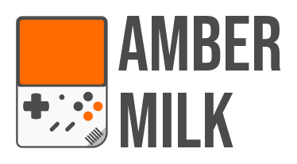
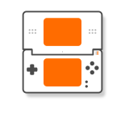
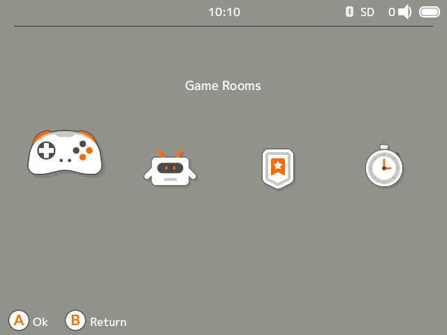
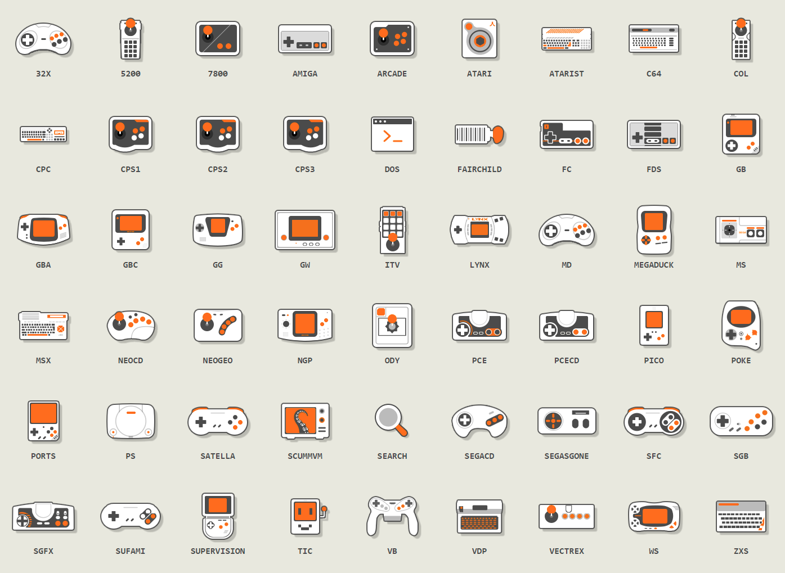
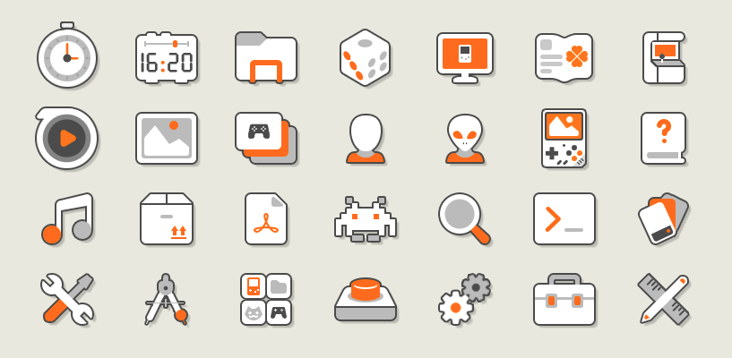

&nbsp;

#

**This is a port of Segich's fantastic Miyoo Mini Milk theme, designed for the stock OS of the Ambernic RG35XX Plus retro handheld system. Featuring warm white and soft orange colors, and cute illustrations, this theme is perfect for fans of retro gaming who want to enjoy a blast from the past.**

Changes/added assets:
* Added icons/images for the new systems, most notably PSP, N64, NDS, DC
* Replaced bluetooth, speaker, charge icons
* Revamped game menu
* Four different "backgrounds"
* Button templates for the bottom hints

    
    
    
    
    

    
    &nbsp;&nbsp;&nbsp;&nbsp;&nbsp;
    &nbsp;&nbsp;&nbsp;&nbsp;&nbsp;
    

## PREVIEW

    

## THEME ICONS

## SAY THANKS / Original author 

**If you're feeling generous and want to support the original author's work you can check out their &nbsp; <a href="https://ko-fi.com/segich" target="_blank"> Ko-fi</a> &nbsp; page if you want to contribute a little something. It'll help them keep creating awesome themes for retro gaming fans like you.**

#

<i>Icons by <a href="https://ko-fi.com/segich" target="_blank">Segich</a>, <a href="https://icons8.com" target="_blank">Icons8</a>, <a href="https://github.com/OnionUI/Onion" target="_blank">Onion</a>, Dreambrace, Miyoo</i>

You can download the original Miyoo Mini Milk theme here:

